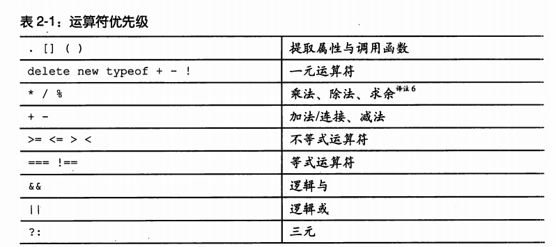

## 第一章 精华

- JavaScript 的函数是主要基于词法作用域(JavaScript 中的函数是根据词法来划分作用域的,而不是动态划分作用域的)的定级对象
- JavaScript 是一门弱类型的远呀,所以 JavaScript 编译器不能检测出类型错误,现在大部门编程语言都流行强类型,其原理是在于强类型允许编译器在编译时检测错误
- JavaScript 有非常强大的对象字面量表示法,通过列出对象的组成部分,它们就能简单的创建出来
- 原型集成是 JavaScript 中一个有争议的特性,JavaScript 有一个无类型的(class-free)对象系统,在这个系统中,对象直接从其他对象继承属性.对于直接通过类创建对象的程序员来说,原型继承是一个陌生的概念.

  本书中贯彻始终都会用到的一个 method 方法定义新的方法,下面是他的定义:

  ```javascript
  Function.prototype.method = function(name, func) {
    this.prototype[name] = func;
    return this;
  };
  ```

## 第二章 语法

- 空白表现为被格式化的字符或者注释的形式
- 标识符由一个字母开头,其后可选择性的加上一个或多个字母.数字或下划线,标识符不能使用 JavaScript 的保留字
- 数字 JavaScript 只有一个数字类型,它在内部被表示为 64 位的浮点数,NaN 是一个数值,它表示一个不能产生征程结果的运算结果,NaN 不等于任何值,包括他自己,可以使用 isNaN(number)检测 NaN
- 字符串 JavaScript 在被创建的时候,Unicode 是一个 16 位的字符集,所以 JavaScript 中的所有字符都是 16 位的.
- 语句中被当成 false 的有 false null undefined 空字符串 0 NaN 其他所有的会被当成 true, for in 会循环可枚举属性,包括原型链上的.

```javascript
for (item in obj) {
  //可以过滤掉原型链上的可枚举属性
  if (obj.hasOwnProperty(item)) {
  }
}
```

- 表达式



- 字面量 对象字面量是一种可以方便的创建新对象的表示法,**属性名可以使标识符或者字符串**
- 函数

## 第三章 对象

### 对象字面量

对象的属性可以使包括空字符串在内的任何字符创,在对象字面量中,如果属性名字是一个合法的 JavaScript 标识符且不是保留字,则并不强制要求用引号括住属性名
"first-name"是必须的,first_name 则是可选的

### 检索

有两种方式`[] 或者 .`

```javascript
obj["first-name"];
obj.name;
```

如果尝试从 `undefined` 的成员属性中取值将会导致 `TypeError` 异常,可以通过&&运算符避免

```javascript
obj.name && obj.name.firstName;
```

### 更新

```javascript
obj.name = "heyushuo"; //如果对象有name则跟新,没有则添加属性
```

### 引用

```javascript
var a = {};
var b = {};
var c = {};
//a b c 每个都引用一个不同的空对象
a = b = c = {};
//a b c 都引用一个空对象
```

### 原型

```javascript
Object.create = function(o) {
  var F = fucntion(){};
  F.prototype = o;
  return new F();
};
```

原型链只有在检索值的时候才被用到,如果我们尝试获取对象的某个属性的值,但是该对象没有此属性名,那么 JavaScript 会尝试从**原型对象中获取属性值**,那么从他的原型中寻找,以此类推,直到最后到`达终点Object.prototype`,如果想要的属性完全不存在原型链中,那么结果为`undefined`,这个**过程称为委托**

```javascript
obj.name;

obj中没有回去obj.__proto__, 如果还没有会obj.__proto__.__proto__;

obj.__proto__.__proto__ == Object.prototype;

Object.prototype.__proto__ == null;
```

### 反射

可以使用 hasOwnProperty 方法,检查对象独有的属性,此方法不会检查原型链中的属性

### 枚举

```javascript
for (item in obj) {
  //可以过滤掉原型链上的可枚举属性
  if (obj.hasOwnProperty(item)) {
  }
}
```

### 删除

`delete` 运算符可以用来删除对象的属性,如果对象包含该属性,那么该属性就会被移除,它**不会触及原型链中的任何对象**.

**删除对象的属性可能会让来自原型链中的属性透视出来**

```javascript
obj.nickname; // heyushuo

delete obj.nickname;

obj.nickname; // kebi
```

### 减少全局变量污染

最小化使用全局变量的方法之一是**为你的应用只创建一个唯一的全局变量**

```javascript
var myApp = {};
```

下一章,另外一种有效减少全局污染的方法,使用闭包来进行信息隐藏的方式

## 第四章 函数

对象字面产生的对象连接到`Object.prototype`函数对象连接到`Function.prototype`(该原型对象本身连接到`Object.prototype`)

### 方法调用模式

当函数被保存为对象的一个属性,当方法被调用时,this 被绑定到该对象.

```javascript
var myObject = {
  name: "heyushuo",
  changeFn: function() {
    this.name = "kebi";
  }
};
```

```javascript
var sum = add(2, 3);
// 此模式调用函数的时候,this被绑定到全局对象
```

这次是语言设计上的一个错误,这个错误的**后果是方法不能利用内部函数来帮助它工作**,因为**内部函数的 this 被绑定到了 window**
这个错误也很用解决就是通过`var that = this;`现在 ES6 可以直接使用**箭头函数来解决此问题**

### 扩充类型的功能

```javascript
Function.prototype.method = function(name, func) {
  this.prototype[name] = func;
  return this;
};
```

给 Number 添加一个 integer 方法

```javascript
Number.method("integer", function() {
  return Math[this < 0 ? "ceil" : "floor"](this);
});
```

给字符串添加一个移除首尾空白的方法

```javascript
String.method("trim", function() {
  return this.replace(/^\s+|\s+$/g, "");
});
```

### 闭包

高级程序设计三中:闭包是指有权访问另外一个函数作用域中的变量的函数.可以理解为(能够读取其他函数内部变量的函数)

闭包的作用: 正常函数执行完毕后,里面声明的变量被垃圾回收处理掉,但是闭包可以让作用域里的 变量,在函数执行完之后依旧保持没有被垃圾回收处理掉
[闭包](https://github.com/heyushuo/Blob/issues/5)

### 模块

可以使用函数和闭包来构造模块

这种方式可以减少把变量定义到全局,儿污染全局变量

这种模块的形式优势 1.可以吧变量私有化,外部无法访问,也不用设置全局变量

```javascript
var maker = function() {
  var prefix = "";
  var seq = 0;
  return {
    set_prefix: function(p) {
      prefix = p;
    },
    set_seq: function(s) {
      seq = s;
    },
    gensym: function() {
      var result = prefix + seq;
      seq += 1;
      return result;
    }
  };
};

var seqer = maker();
seqer.set_prefix("Q");
seqer.set_seq(1000);
seqer.gensym(); //结果是 Q1000
```

### 级联

函数封装最后返回`this`就可以链式调用

### 函数柯利化

[**函数柯里化**](https://github.com/heyushuo/Blob/issues/27)

### 记忆

**斐波那契数列 1 1 2 3 5 8...**

通过数学归纳法可以得到`fn(n)=fn(n)+fn(n+1);`

```javascript
var fn = function(n) {
  console.log(1);

  return n < 2 ? n : fn(n - 1) + fn(n - 2);
};
```

**优化后**
使用记忆这个特性,把值保存起来,等下次在计算的时候直接取值,不用再次计算

```javascript
(function() {
  var memo = [1, 1];
  var fn = function(n) {
    var result = memo[n];
    if (!result) {
      result = fn(n - 1) + fn(n - 2);
    }
    return result;
  };
  return fn;
})();
```

## 第五章 继承

建议看《高级程序设计三》的第六章的继承

---

# 发现这本书还是比较基础的建议读《高级程序设计三》或者《你不知道 Javascript》
